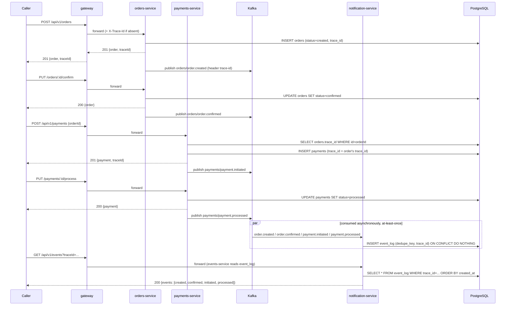
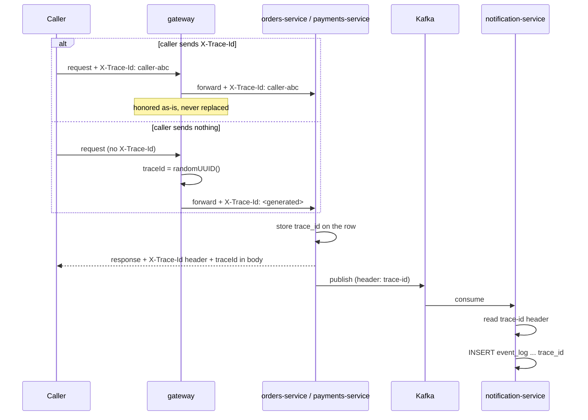
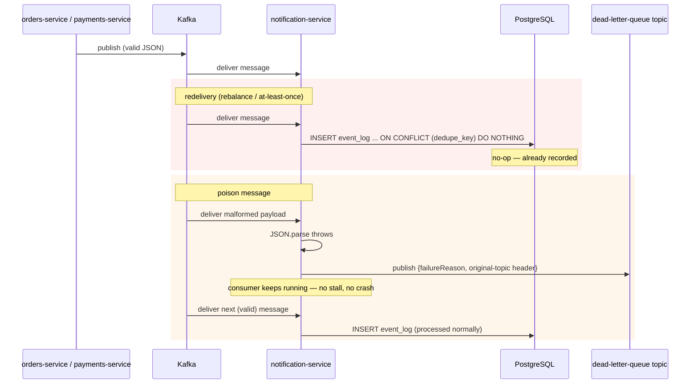

# Sequence Diagrams

These trace the three flows the [ADRs](adr/README.md) reference most: the order
saga, trace-id propagation, and the dead-letter/idempotency path. All three
describe the **microservices** runtime topology (gateway → services → Kafka →
`notification-service`); `mock-server.js` collapses the same behavior into one
process (see [ADR-0003](adr/0003-mock-server-monolith-for-local-dev-and-ci-parity.md))
so its sequence is the same story with the Kafka round-trip removed.

## 1. Order saga: create → confirm → pay → process

The path exercised by `tests/microservices/tracing.spec.ts`'s first test and, in
its individual steps, by `event-contracts.spec.ts`. `orders-service` and
`payments-service` never write to `event_log` themselves — see
[ADR-0002](adr/0002-single-kafka-consumer-owns-event-log-writes.md).

Note: `payments-service` never mints its own trace id — it reads the parent
order's ([ADR-0007](adr/0007-one-trace-id-per-order-assigned-at-the-edge.md)), so
every event in this saga, across both topics, shares one `trace_id`.

## 2. Trace-id propagation: caller-supplied vs. edge-assigned

Verified end to end by `tracing.spec.ts`'s "a caller-supplied X-Trace-Id is
honored end to end, not replaced" test.

## 3. Dead-letter queue and idempotent consumption

Both mechanisms live entirely inside `notification-service`'s consumer loop — see
[ADR-0005](adr/0005-idempotent-consumption-and-dead-letter-queue.md). Kafka's
at-least-once delivery means both paths are exercised in normal operation, not
only under failure.

